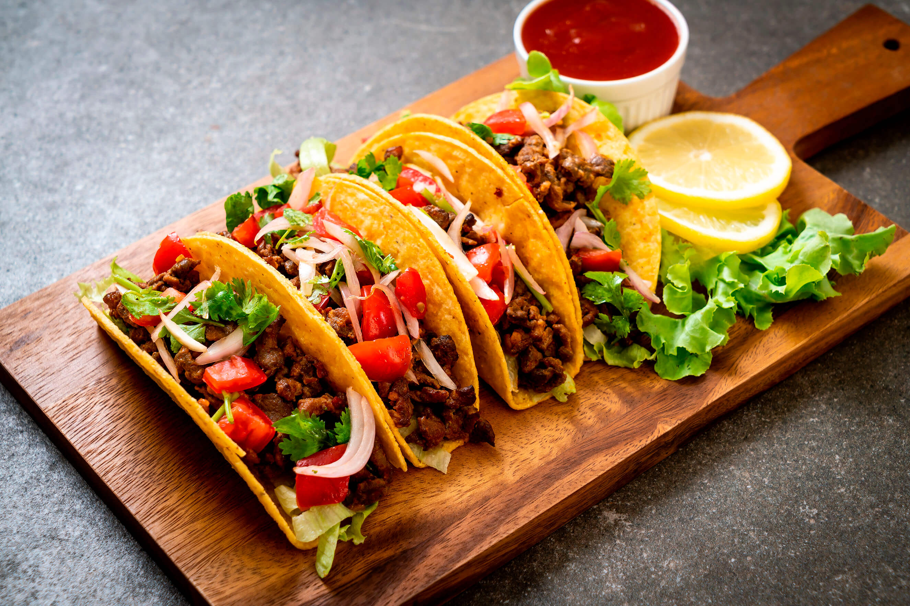

# Korrila React Receipts



## Overview

Korilla is Korean barbecue tacos truck that makes thousands of hungry customers happy every year. Their CEO is thinking of updating their short order tracking system using React. Build a prototype of this short order receipts tracker.

## Objectives

- Create a new `korrilla-receipts` app with `create-react-app`
- Create a reusable component that can be rendered with various data
- Pass data down using props

## What You'll Be Building


You will be trying to create an app that mirrors this layout with the provided data.

## Getting Started

- `Fork` and `clone` this repository and `cd` into this directory.
- Run `npx create-react-app korrilla` in this directory.
- `cd` into the newly created `korrilla` app.
- Begin work in the new app.
- Run your react server with `npm start`

## Instructions

You'll be rendering some sample receipts:

```js
const receipt1 = {
  person: "Ben",
  order: {
    main: "Burrito",
    protein: "Organic Tofu",
    rice: "Purple Rice",
    sauce: "Green Crack",
    toppings: ["Baby Bok Choy", "Cucumber Kimchi"],
    drink: "Korchata",
    cost: 22
  },
  paid: false
};
const receipt2 = {
  person: "Michael",
  order: {
    main: "Rice Bowl",
    protein: "Ginger Soy Chix",
    rice: "Sticky Rice",
    sauce: "Korilla",
    toppings: ["Yuzu Pickled Sweet Pepper", "Kale"],
    drink: "Korchata",
    cost: 19
  },
  paid: false
};
const receipt3 = {
  person: "John",
  order: {
    main: "Salad Bowl",
    protein: "Organic Tofu",
    rice: "none",
    sauce: "K'lla",
    toppings: ["Blue Potato Salad", "Pico De Gallo", "Red Kimchi"],
    drink: "Sparkling Blood Orange Soda",
    cost: 20
  },
  paid: true
};
```

1. Make a Receipt component that renders the first receipt

- person
- order
  - main
  - protein
  - rice
  - sauce
  - drink
  - cost

2. Repeat the process for the other two receipts.

### Bonus: Conditionally Render the receipts if they have been paid or not

Right now, all the receipts are not paid ( `paid: false`)

Set up a ternary operator to display the receipt if it has not been paid.

Then go into the receipt data and change the value to true and check that the receipt will not display

### SUPER SUPER Bonus : Refactor for Dynamic Rendering

3 receipts is pretty limiting. Let's put them in an array and then map over them for rendering.

Update your code so it renders the same, but instead of hard coding 3 receipts, it maps over the array.

```js
const receipts = [
  {
    person: "Ben",
    order: {
      main: "Burrito",
      protein: "Organic Tofu",
      rice: "Purple Rice",
      sauce: "Green Crack",
      toppings: ["Baby Bok Choy", "Cucumber Kimchi"],
      drink: "Korchata",
      cost: 22
    },
    paid: false
  },
  {
    person: "Michael",
    order: {
      main: "Rice Bowl",
      protein: "Ginger Soy Chix",
      rice: "Sticky Rice",
      sauce: "Korilla",
      toppings: ["Yuzu Pickled Sweet Pepper", "Kale"],
      drink: "Korchata",
      cost: 19
    },
    paid: false
  },
  {
    person: "John",
    order: {
      main: "Salad Bowl",
      protein: "Organic Tofu",
      rice: "none",
      sauce: "K'lla",
      toppings: ["Blue Potato Salad", "Pico De Gallo", "Red Kimchi"],
      drink: "Sparkling Blood Orange Soda",
      cost: 20
    },
    paid: true
  }
];
```
# korilla-receipts
